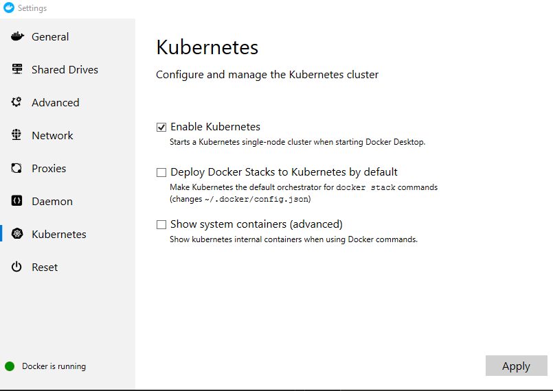
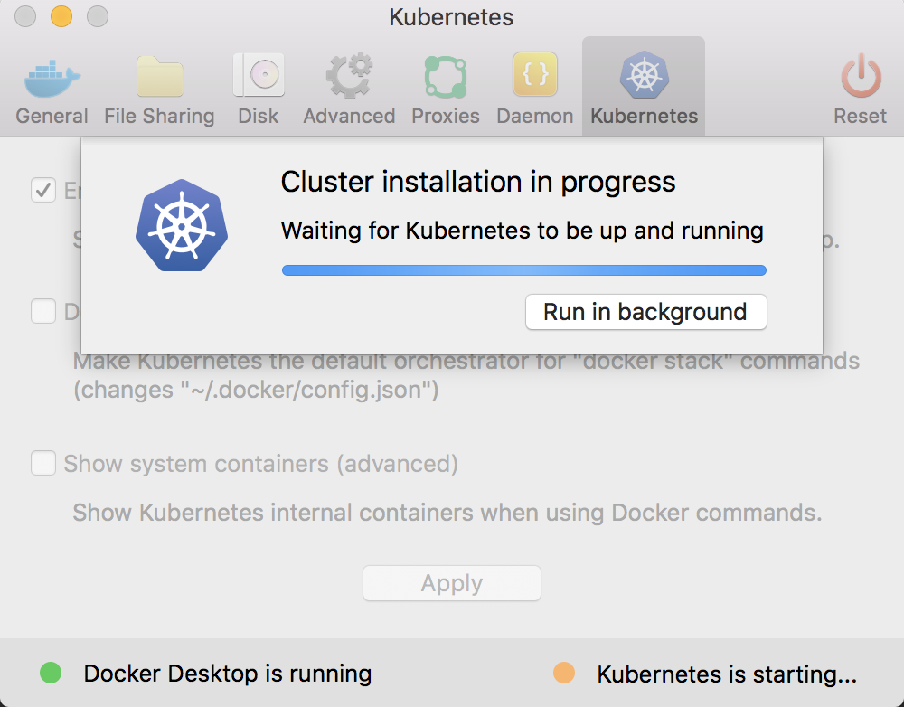
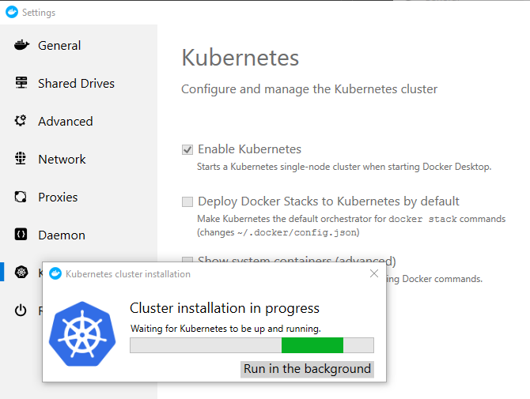
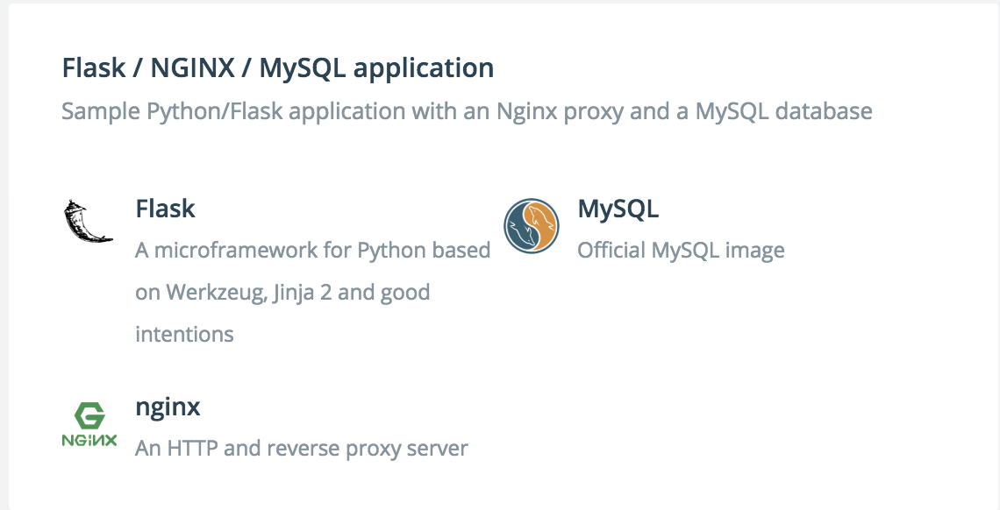
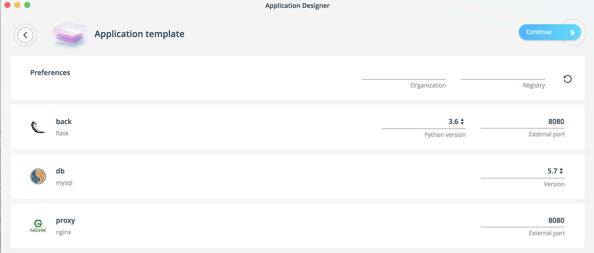
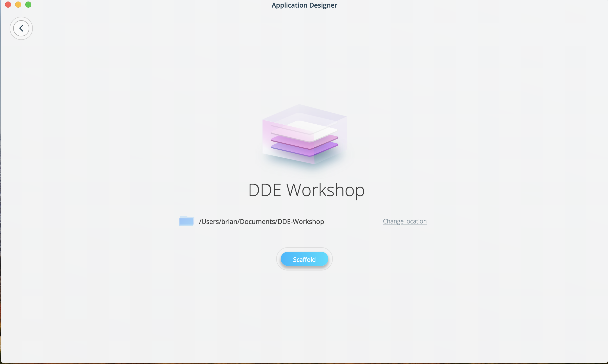

# Developing applications with Docker Desktop Enterprise

Docker Enterprise 3.0 is the first Containers-as-a-Service platform that extends from the developer’s desktop to production. Docker Desktop Enterprise offers developers the ability to create container-based applications quickly and easily, even if they have little prior knowledge of Docker or Kubernetes. Developers on Windows 10 can create both Windows and Linux applications, and developers on macOS can create Linux applications with Docker Desktop Enterprise. Application Templates enable developers to build modern applications using a library of predefined and organization-approved application and service templates, without requiring prior knowledge of Docker commands. By providing re-usable “scaffolding” for developing modern container-based applications, Application Templates accelerate developer onboarding and improve productivity. Docker Enterprise is the first platform to support both Docker Swarm and Kubernetes orchestration which also extends to developer desktops with Docker Desktop Enterprise. Docker Desktop Enterprise includes the ability to ensure matching API versions through the use of Version Packs.

In this lab, we’ll use Docker Desktop Enterprise to create container-based applications locally. If you’re also running the Docker Enterprise workshop, you will have the opportunity to push these applications to the Docker Enterprise cluster using both Swarm and Kubernetes.

Suggested workshop order:
* Task 1 - Task XX in this workshop can be run as a standalone workshop using only Docker Desktop Enterprise. 
* If running in conjunction with the [Docker Enterprise workshop](README.md) you can switch over and run Task 1 in that workshop to setup your Docker Enterprise environment.
* After completing Task 1 in the Docker Enterprise workshop you can return to this lab and complete Task XX - XX to push and deploy applications to your cluster.

**System Requirements**


  You need Docker Desktop Enterprise installed on your laptop or workstation with internet access to complete this lab. An XX-day evaluation license is included with the download of Docker Desktop Enterprise.
 * You will also need a code editor of your choice. Instructions here demonstrate the use of [Microsoft Visual Studio Code (vscode)](https://code.visualstudio.com/download), but any code editor should work.
   * No knowledge of the code syntax is assumed.
   * Some steps demonstrate the use of the [Docker plugin](https://marketplace.visualstudio.com/items?itemName=ms-azuretools.vscode-docker) in vscode; many code editors have Docker plugins available that should function similarly. The plugins are not required and the equivalent command will be given to complete the step.
   * **The Docker Desktop Enterprise download is approximately 1.8 GB so please download and install before the workshop**

**Windows OS Requirements**
>  
> * Windows 10 Professional or Enterprices
>   * Hyper-V features enable. If you want to see how to enable Hyper-V, [check it out over here.](https://docs.microsoft.com/en-us/virtualization/hyper-v-on-windows/quick-start/enable-hyper-v). 
> * [Download Docker Desktop Enterprise for Windows 10](https://docs.docker.com/ee/desktop/admin/install/windows/)
> * Windows 10 Pro or Enterprise


**Mac OS Requirements**
>   * [Download Docker Desktop Enterprise for macOS](https://docs.docker.com/ee/desktop/admin/install/mac/)
> * macOS: Docker Desktop requires macOS 10.12 and newer
> * Mac Hardware must be a 2010 or newer model


 **Difficulty**: Intermediate (assumes basic familiarity with Docker) If you're looking for a basic introduction to Docker, check out [https://training.play-with-docker.com](https://training.play-with-docker.com)

 **Time**: Approximately XX minutes

> **Introduction**:
>	* [What is the Docker Enterprise Platform](#intro1)
>	* [Overview of Docker Desktop Enterprise](#intro2)
> * [Overview of Orchestration](#intro3)
>   * [Overview of Docker Swarm mode](#intro3.1)
>   * [Overview of Kubernetes](#intro3.2)

> **Tasks**:
> * Using Docker Desktop Enterprise
>   * [Task 1: Configure Docker Desktop Enterprise](#task1)
>     * [Task 1.1: Launch Docker Desktop Enterprise](#task1.1)
>     * [Task 1.2: Admin settings](#task1.2) 
>     * [Task 1.3: Enable Kubernetes](#task1.3)
>     * [Task 1.4: Use Buildkit](#task1.4)
>   * [Task 2: Create an Application Template](#task2)
>     * [Task 2.1: Choose a Template](#task2.1)
>     * [Task 2.2: Customize the Template Settings](#task2.2)
>     * [Task 2.3: Scaffold the Application Template](#task2.3)
>     * [Task 2.4: Start the Application](#task2.4)
>   * [Task 3: Develop an Application with Docker Desktop](#task3)
>     * [Task 3.1: Add a Custom Template Repository](#task3.1)
>     * [Task 3.2: Choose the New Template](#task3.2)
>     * [Task 3.3: Scaffold the Application Template](#task3.3)
>       - Show `template` CLI too
>     * [Task 3.4: Start the Application](#task3.4)
>     * [Task 3.5: Live Code Changes](#task3.5)
>     * [Task 3.6: Customize the Application](#task3.6)
>     * [Task 3.7: Deploy the Application on Kubernetes](#task3.7)
>   * [Task XX: Using Docker Assemble](#taskXX)

> * Deploying to Docker Enterprise Clusters
>   * These tasks should be completed after completing Task 1 in the [Docker Enterprise](README.md) workshop
>   * [Task 4: Connecting to Docker Enterprise UCP and DTR](#task4)
>     * [Task 4.1: Client Bundles](#task4.1)
>     * [Task 4.2: Docker Context](#task4.2)
>   * [Task 5: Push to DTR](#task5)
>     * [Task 5.1: Push Images to DTR](#task5.1)
>     * [Task 5.2: Bundle the Application](#task5.2)
>     * [Task 5.3: Push Docker App to DTR](#task5.3)
>   * [Task 6: Deploy App to UCP](#task6)
>     * [Task 6.1: Deploy to Swarm](#task6.1)
>     * [Task 6.2: Deploy to Kubernetes](#task6.2)


## Document conventions

- When you encounter a phrase in between `<` and `>`  you are meant to substitute in a different value.

	For instance if you see `<your email>` you would actually type something like `myemail@host.com`

## <a name="intro1"></a>Introduction
**JIM TO UPDATE** -- Docker Enterprise provides an integrated, tested and certified platform for apps running on enterprise Linux or Windows operating systems and Cloud providers. Docker Enterprise is tightly integrated to the the underlying infrastructure to provide a native, easy to install experience and an optimized Docker environment. Docker Certified Infrastructure, Containers and Plugins are exclusively available for Docker Enterprise with cooperative support from Docker and the Certified Technology Partner.

### <a name="intro2"></a>Overview of Docker Desktop Enterprise
**JIM TO PROVIDE**

### <a name="intro3"></a>Overview of Orchestration in Docker Desktop
#### <a name="intro3.1"></a>Overview of Docker Swarm mode
A Swarm is a group of machines that are running Docker and joined into a cluster. After that has happened, you continue to run the Docker commands you’re used to, but now they are executed on a cluster by a Swarm manager. The machines in a Swarm can be physical or virtual. After joining a Swarm, they are referred to as nodes.

Swarm mode uses managers and workers to run your applications. Managers run the Swarm cluster, making sure nodes can communicate with each other, allocate applications to different nodes, and handle a variety of other tasks in the cluster. Workers are there to provide extra capacity to your applications.

With Docker Desktop Enterprise, you have a single Docker node. Because it is a single node, Swarm mode is not enabled by default, however, Swarm mode can be enabled if required to test commands or features which are only available in Swarm mode. These commands or features include `docker stack deploy` or the `docker service` commands.

In a multi-node clustered environment, Swarm mode uses managers and workers to run your applications. Managers run the swarm cluster, making sure nodes can communicate with each other, allocating applications to different nodes, and handling a variety of other tasks in the cluster. Workers are there to provide the capacity for your applications. If you are completing the [Docker Enterprise workshop](README.md) along with these exercises you will have a remote cluster with one manager and three workers and later tasks will have you push images and deploy applications from your Docker Desktop Enterprise to the remote cluster.

#### <a name="intro3.2"></a>Overview of Kubernetes

Kubernetes is part of Docker Enterprise 3.0 in both Docker Desktop Enterprise and Docker Enterprise referred to as Docker Kubernetes Service or DKS. Kubernetes deployments tend to be more complex than Docker Swarm, and there are many additional component types within Kubernetes. The Universal Control Plane (UCP) in Docker Enterprise clusters simplifies much of the complexities using Kubernetes. The Docker platform includes a [fully-comformant Kubernetes Distribution](https://www.cncf.io/certification/software-conformance). We'll concentrate on Pods and Load Balancers in this workshop, but there's plenty more supported by UCP 2.XX.

## <a name="task1"></a>Task 1: Configure Docker Desktop Enterprise
Docker Desktop Enterprise installation comes pre-configured with administration tools. The admin settings enable administrators to configure Docker Desktop for developer teams and we'll explore some of the administration settings in this section.

### <a name="task 1.1"></a>Task 1.1: Launch Docker Desktop Enterprise
The first time you launch Docker Desktop Enterpirse it will prompt you for a license file. You can install the license file directly through the prompt or manually based on your Operating System

**Mac**

Install the Docker Desktop Enterprise (DDE) license file at the following location:

  `/Library/Group Containers/group.com.docker/docker_subscription.lic`

**Windows**

Install the Docker Desktop Enterprise (DDE) license file at the following location for Windows users:

  `%ProgramData%\DockerDesktop\docker_subscription.lic`


### <a name="task 1.1"></a>Task 1.2: Admin Settings

System administrators can configure Docker Desktop Enterprise (DDE) settings, specify and lock configuration parameters to create a standardized development environment based on the developers operating systems.

* Show admin-settings.json (lockable settings)
  * Windows location: `\%ProgramData%\DockerDesktop\admin-settings.json` which defaults to `C:\ProgramData\DockerDesktop\admin-settings.json`.  
  **NOTE:** You need Administrator privelages to edit this file
  * Mac location: `/Library/Application\ Support/Docker/DockerDesktop`

The `admin-settings.json` allows the configuration of DDE settings. Each configuration can be configured with a default value and whether this value is locked for users or not. The configurations include:

 * `proxy` allow users to change the proxy settings
 * `filesharingDirectories` Which directories are shared with Docker Desktop
 * `CPU` number of CPU cores
 * `memoryMib` amount of memory allocated to Docker Desktop
 * `dataFolder` Where Docker stores date
 * `diskSizeMib` amount of disk space allocated to Docker Desktop of for images, volumes, etc
 * `swamMib` amount of swamp memory for Docker Desktop
 * `kubernetes` enable Kubernetes
 * `showSystemContainers` Shows containers running in the background

1. Navigate to the `admin-settings.json` location based on your Operating System. See above for the location for Mac or Windows.
2. Using your favorite editor, open the `admin-settings.json` file and review the available configurations.

The `dockerdesktop-admin` tool allows System Administators to manage DDE applications version packs from the command line.

**Mac**
* Show dockerdesktop-admin tool
  * Mac location: `/Applications/Docker.app/Contents/Resources/bin`
  * `sudo ./dockerdesktop-admin --help`
    * `sudo ./dockerdesktop-admin app uninstall` to remove DDE and VPs (do not run!)
* Install a Version Pack with dockerdesktop-admin tool
  * `sudo ./dockerdesktop-admin version-pack install <path to ddvp>`
	* Note that Desktop needs to be stopped to add a Version Pack

**Windows**
* Show dockerdesktop-admin tool
  * Windows location: `[`*`ApplicationPath`*`]\dockerdesktop-admin.exe`
* Install a Version Pack with dockerdesktop-admin tool
  * `dockerdesktop-admin.exe -InstallVersionPack=['path-to-archive']`
* Version-pack uninstall with dockerdesktop-admin tool
  * `dockerdesktop-admin.exe -UninstallVersionPack=[version-pack-name|'path-to-archive']`
  * **NOTE:** You must stop Docker Desktop before installing a version pack.

### <a name="task1.2"></a>Task 1.3: Enable Kubernetes

Enabling Kubernetes in Docker Desktop only requires a single click.

> NOTE: Offline mode is supported when enabling Kubernetes in Docker Desktop Enterprise.

1. Open Docker Desktop Enterprise -> Settings
2. Switch to the Kubernetes Tab
3. Check the `Enable Kubernetes` box
4. Click Apply. This will take a couple minutes depending on the performance of your computer

**Mac**


**Windows**



5. Run the Kubernetes Cluster creation in the background and will be ready once the Kubernetes status turns green

**Mac**



**Windows**



Congratulations! Docker Desktop Enterprise is now ready to deploy applications to use either Swarm or Kubernetes.

### <a name="task1.2"></a>Task 1.4: Use Buildkit

**Jim** can you provide more background what you need here?

By default, Docker Desktop uses Build.XX. Buildkit is not required for any exercises in this workshop but we will go ahead and enable it so you can see it in action in case you want to explore advanced build actions on your own.

1. Right Click `Docker Desktop Enterprise` -> `Settings`
2. Open the `Deamon` Tab
3. Switch to the `Advanced Tab` This is the Docker Daemon configuration file `daemon.json` 
4. Delete the existing configuration
5. Copy and paste the `daemon.json` configuration below

**Jim** Windows app doesn't have Daemon > advanced tab. Do we need to split this out as a seperate Windows section [marcel]?

```json
{
  "debug" : true,
  "experimental" : false,
  "features": { "buildkit": true }
}
```
5. Click the `Apply & Restart` button

Docker Desktop Enterprise is now running with Buildkit enabled.

## <a name="task2"></a>Task 2: Create an Application Template

In this section, we will explore the capabilities of the DDE Application Designer. The Application Designer comes with a librbary of pre-configured application templates. The Apllication Designer is a visual designer enabling developers to create Docker based applications.  

### <a name="task2.2"></a>Task 2.1: Choose a Template

Next, we will explore the Application Designer and learn how to design a new application. When we create a new application we are provided the choice to use a template which contains preconfigured applications or define a custom applications.

1. Reight Click on `Docker Desktop` -> `Design new application`


2. Select `Choose Template`

3. Choose the `Flask/ NGINX / MYSQL application`



### <a name="task2.2"></a>Task 2.2: Customize Template Settings

Customize the default settings of the `Flask/ NGINX / MYSQL application` template

1. Remove port `8080` from Flask and leave blank as we don't want the backend to communicate directly to the internet.

2. Change the port of the NGINX Proxy from port `80` --> `8081` so now the NGINX proxy is handeling routing of traffic to the backend service.



### <a name="task2.3"></a>Task 2.3: Scaffold the Application Template

The scaffoloding of the template copies all the necessary Dockerfiles, docker-compose, and application specific files locally to DDE. Once all the files have been copied locally, DDE then builds the images and prepares them for use.

1. Name the Application

2. Change the `location` of Scaffolded project, if required.

3. Click `Scaffold`

4. Open `Show Logs` to view the log output from `docker-compose` starting the application stack in the foreground allowing us to view all the logs for each contianer in the stack.



### <a name="task2.4"></a>Task 2.4: Start the Application

Once the `Scaffold` has complete we have the option to `Run Application`

1. Click `Run Application`


The log output displays `docker-compose` starting the application stack in the foreground allowing us to view all the logs for each contianer.

## <a name="task3"></a>Task 3: Develop an Application with Docker Desktop

In this section we will add a custom template repository allowing us to import our own custom application templates. Our demo application is a Link Extractor application containing a PHP Frontend and an API written in Python. Next, we will make some live coding changes to the running application, customize the application by upgrading the Docker images, and finally deploy our application to Kubernetes.

### <a name="task3.1"></a>Task 3.1: Add a Custom Template Repository

It is also possible to add a custom template repository to DDE. The `library.yaml` file defines the plugins and application dependencies required for the new template.

The Docker Desktop Enterprise Application Designer is configured with a standard library of Application templates. We will add an additional custom library for this hands on lab. The library configuration is defined in the `preferences.yaml` file. Here we define where the Desktop Designer will fetch the `library.yaml` files from.

Using your favorite text editor edit `preferences.yaml`. The library configuration can be found at:
 
**Mac/Linux**

    /Users/<user>/.docker/application-template/preferences.yaml

**Windows**

    C:\Users\<user>\.docker\application-template\preferences.yaml


Add a new repository, which is shown below the `library` repository as the `custom-services` repository with a URL pointing to the DDE Lab GitHub Repo. The file should look like this when you're done:


    apiVersion: v1alpha1
    disableFeedback: true
    kind: Preferences
    repositories:
    - name: library
      url: https://docker-application-template.s3.amazonaws.com/production/v0.1.5/library.yaml
    - name: custom-services
      url: https://raw.githubusercontent.com/JimCodified/dde-handsonlab/master/labsetup/appdesignertemplates/library.yaml

### <a name="task3.2"></a>Task 3.2: Choose new Library Template

Next, the `custom-services` template will now be avaialble when we open `Application Designer` and `Choose a template`

1. Right Click on `Docker Desktop` -> `Design new application`

2. Select `Choose Template`

3. Choose the `Flask/ Apache application`


### <a name="task3.3"></a>Task 3.3: Scaffold the Application Template

The scaffoloding of the template copies all the necessary Dockerfiles, docker-compose, and application specific files locally to DDE. Once all the files have been copied locally, DDE then builds the images and prepares them for use.

1. Name the Application `links-app`

2. Change the `location` of Scaffolded project, if desired.

3. Click `Scaffold`

4. Open `Show Logs` to view the log output from `docker-compose` starting the application stack in the foreground allowing us to view all the logs for each contianer in the stack.

### <a name="task3.4"></a>Task 3.4: Start the Application

Once the `Scaffold` has complete we have the option to `Run Application`

1. Click `Run Application`


Inside the `links-app` project we can see the live log output from our application stack. We also have the possability to `Stop` or `Restart` our application stack.

2. Open the `links-app` in a browser tab [http://localhost](http://localhost)
3. Test the `links-app` by providing a full URL `https://www.docker.com`
4. Click `Extract Links` button 
5. Let's test the API as well. Open a new Browser tab. Copy and paste `http://localhost:5000/` which returns the usage of the API
6. Provide a query to the API. Copy and paste `http://localhost:5000/api/https://docker.com` which displayes the same results from the the UI but in `JSON` format.

### <a name="task3.5"></a>Task 3.5: Live Code Changes

Now, we will make changes to our running Links application. The `Application Designer` comes with the included feature to launch `Visual Studio Code` (VS Code) directly in the project directory or Open Windows Explorer or Finder on Mac and edit the files directly with another editor. In this example, we will use `Visual Studio Code`

1. Click the `Open in Visual Studio Code` which now opens the `links-app` in VS Code.
2. Navigate and open `www/index.php`
3. Change the HTML Color on line #61 & #62 from `#082E41` to `#007bff` and save the `index.php`

```css
      div.header {
        background: #007bff;
        margin: 0;
      }
      div.footer {
        background: #007bff;
        margin: 0;
        padding: 5px;
      }
```
4. Return to your Browser Tab running [http://localhost](http://localhost) and refresh the page. You should now see the `links-app` has been rebranded with Docker colors.

### <a name="task3.6"></a>Task 3.6: Customize the Application 

We can also customize the Application Stack. In this task, we will upgrade the `links-app` images to the newest version.

1. Click the `Open in Visual Studio Code` which now opens the `links-app` in VS Code.
2. Open the `docker-compose.yml` file in the root of the `links-app` directory
3. Update Docker images for both `api` and `www` services which should match the below

```yaml
version: "3.6"
services:
  api:
    build: api
    image: ollypom/ee-templates-api:step4-v1
    ports:
    - 5000:5000
  www:
    environment:
    - API_ENDPOINT=http://api:5000/api/
    image: ollypom/ee-templates-web:step4-v1
    ports:
    - 80:80
    volumes:
    - ./www/web:/var/www/html
```

4. Save the `docker-compose.yml` file
5. Inside `Application Designer` click `Restart` which will rebuild the `links-app` using the updated images.

### <a name="task3.7"></a>Task 3.7: Deploy the Application on Kubernetes

## <a name="task4"></a>Task 4: Connecting to Docker Enterprise UCP and DTR
### <a name="task4.2"></a>Task 4.1: Client Bundles
### <a name="task4.2"></a>Task 4.2: Docker Context

## <a name="task5"></a>Task 5: Push to DTR
### <a name="task5.1"></a>Task 5.1: Push Images to DTR
### <a name="task5.2"></a>Task 5.2: Bundle the Application
### <a name="task5.3"></a>Task 5.3: BPush Docker App to DTR

## <a name="task5"></a>Task 6: Deploy to UCP
### <a name="task6.1"></a>Task 5.1: Deploy to Swarm
### <a name="task6.2"></a>Task 5.2: Deploy to Kubernetes

## Conclusion

In this lab we've looked how Docker Enterprise can help you manage both Linux and Windows workloads whether they be traditional apps you've modernized or newer cloud-native apps, leveraging Swarm or Kubernetes for orchestration.

You can find more information on Docker Enterprise at [http://www.docker.com](http://www.docker.com/enterprise-edition) as well as continue exploring using our hosted trial at [https://dockertrial.com](https://dockertrial.com)
