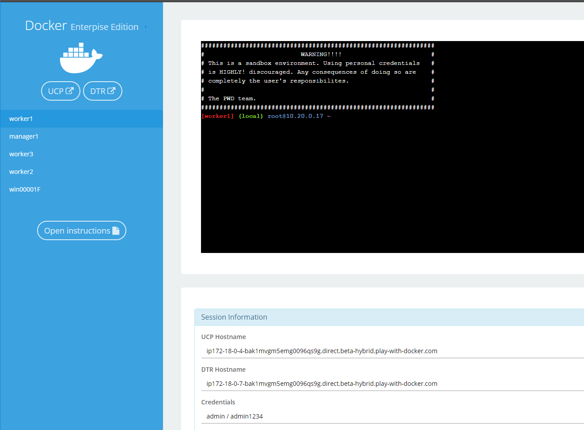
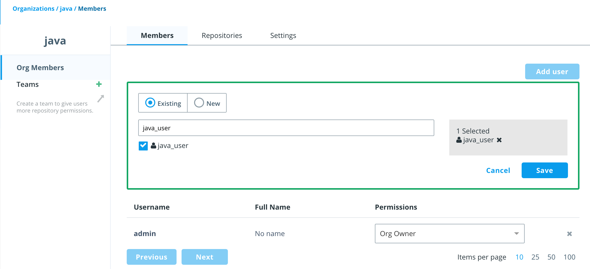
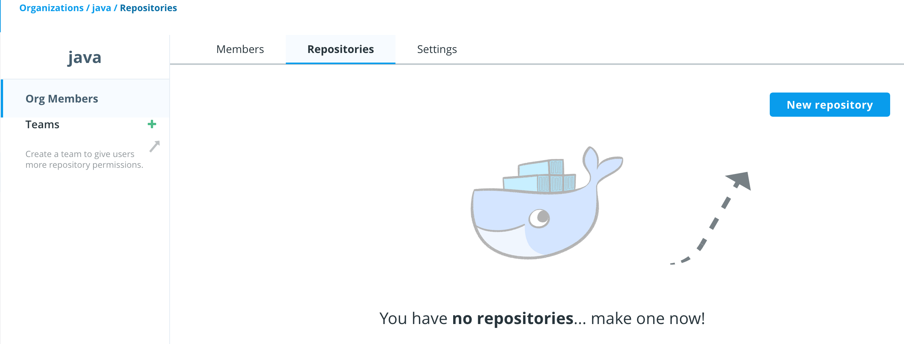
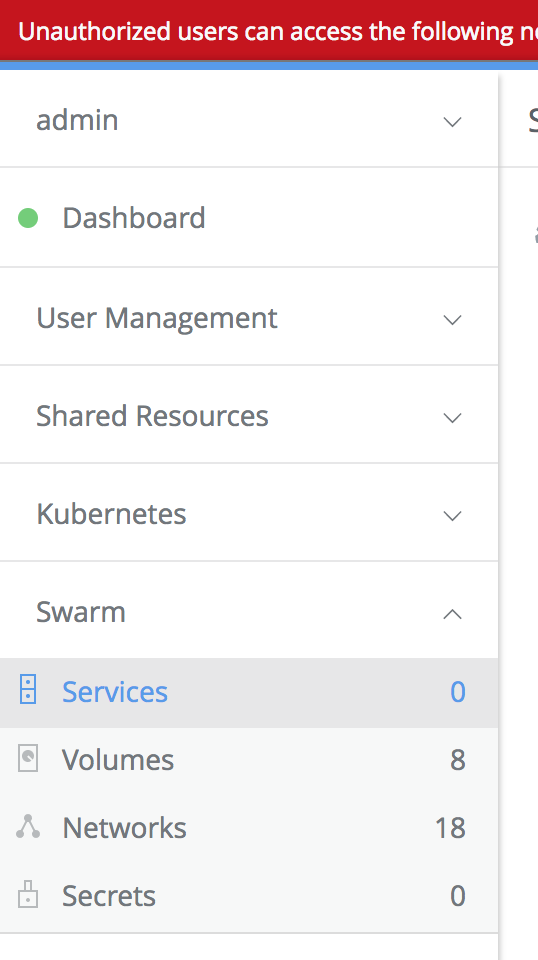
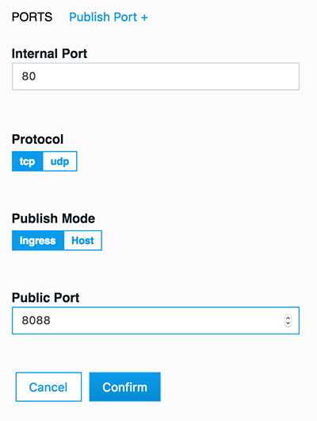

# Deploying Multi-OS applications with Docker EE

Docker EE 17.06 is the first Containers-as-a-Service platform to offer production-level support for the integrated management and security of Linux AND Windows Server Containers.

In this lab we'll use a Docker EE cluster comprised of Windows and Linux nodes. We'll deploy both a Linux and Windows web app, as well as a multi-service application that includes both Windows and Linux components. We will then look at scaling up your web app, as well how Docker EE handles system interruptions and upgrades.

> **Difficulty**: Intermediate (assumes basic familiarity with Docker) If you're looking for a basic introduction to Docker,

> **Time**: Approximately 75 minutes

> **Introduction**:
>	* [What is the Docker Platform](#intro1)
>	* [Overview of Orchestration](#intro2)
>		* [Basics of Docker Swarm mode](#intro2.1)
>		* [Basics of Kubernetes](#intro2.2)

> **Tasks**:
>
> * [Task 1: Configure the Docker EE Cluster](#task1)
>   * [Task 1.1: Accessing PWD](#task1.1)
>   * [Task 1.2: Install a Windows worker node](#task1.2)
>   * [Task 1.3: Create Two Repositories](#task1.3)
>   * [Task 1.3.1: Restrict access to a repository](#task1.3.1)
> * [Task 2: Deploy a Java Web App](#task2)
>   * [Task 2.1: Clone the Demo Repo](#task2.1)
>   * [Task 2.2: Build and Push the Linux Web App Image](#task2.2)
>   * [Task 2.3: Deploy the Web App using UCP](#task2.3)
> * [Task 3: Deploy a Windows .NET App](#task3)
>   * [Task 3.1: Clone the repository](#task3.1)
>   * [Task 3.2: Build and Push Your Image to Docker Trusted Registry](#task3.2)
>   * [Task 3.3: Deploy the Windows .NET App](#task3.3)
> * [Task 4: Deploy a Multi-OS Application](#task4)
>   * [Task 4.1: Examine the Docker Compose File](#task4.1)
>   * [Task 4.2: Deploy the Application Stack](#task4.2)
>   * [Task 4.3: Verify the Running Application](#task4.3)
> * [Task 5: Application Lifecycle Management](#task5)
>   * [Task 5.1: Upgrading the Web Front-end](#task5.1)
>   * [Task 5.2: Scaling the Web Front-end](#task5.2)
>   * [Task 5.3: Dealing with an Application Failure](#task5.3)
> * [Task 6: Deploy to Kubernetes](#task6)
>   * [Task 6.1: Build .NET Core app instead of .NET](#task6.1)
>   * [Task 6.2: Examine the Docker Compose File](#task6.2)
>   * [Task 6.3: Deploy to Kubernetes using the Docker Compose file](#task6.3)
>   * [Task 6.4: Verify the app](#task6.4)

## Understanding the Play With Docker Interface


> TODO: update images, has to wait for example workspace to finalize 

This workshop is only available to people in a pre-arranged workshop. That may happen through a [Docker Meetup](https://events.docker.com/chapters/), a conference workshop that is being led by someone who has made these arrangements, or special arrangements between Docker and your company. The workshop leader will provide you with the URL to a workshop environment that includes [Docker Enterprise Edition](https://www.docker.com/enterprise-edition). The environment will be based on [Play with Docker](https://labs.play-with-docker.com/).

If none of these apply to you, contact your local [Docker Meetup Chapter](https://events.docker.com/chapters/) and ask if there are any scheduled workshops. In the meantime, you may be interested in the labs available through the [Play with Docker Classroom](training.play-with-docker.com).

There are three main components to the Play With Docker (PWD) interface. 

### 1. Console Access
Play with Docker provides access to the 3 Docker EE hosts in your Cluster. These machines are:

* A Linux-based Docker EE 18.01 Manager node
* Two Linux-based Docker EE 18.01 Worker nodes
* A Windows Server 2016-based Docker EE 17.06 Worker Node

> **Important Note: beta** Please note, as of now this is a beta Docker EE 2.0 environment. Docker EE 2.0 shows off the new Kubernetes functionality which is described below.

By clicking a name on the left, the console window will be connected to that node.

### 2. Access to your Universal Control Plane (UCP) and Docker Trusted Registry (DTR) servers

Additionally, the PWD screen provides you with a one-click access to the Universal Control Plane (UCP)
web-based management interface as well as the Docker Trusted Registry (DTR) web-based management interface. Clicking on either the `UCP` or `DTR` button will bring up the respective server web interface in a new tab.

### 3. Session Information

Throughout the lab you will be asked to provide either hostnames or login credentials that are unique to your environment. These are displayed for you at the bottom of the screen.

## Document conventions

- When you encounter a phrase in between `<` and `>`  you are meant to substitute in a different value.

	For instance if you see `<dtr domain>` you would actually type something like `ip172-18-0-7-b70lttfic4qg008cvm90.direct.microsoft.play-with-docker.com`
	> TODO: update 

- When you see the Linux penguin all the following instructions should be completed in your Linux console

	

- When you see the Windows flag all the subsequent instructions should be completed in your Windows console

    

## <a name="intro1"></a>Introduction
> TODO: add exposition on introduction to Docker Platform and its benefits 
### <a name="intro2"></a>Overview of Orchestration
> TODO: Add introduction to orchestration, basic principles of Swarm and Kubernetes 
#### <a name="intro2.1"></a>Overview of Docker Swarm mode
A swarm is a group of machines that are running Docker and joined into a cluster. After that has happened, you continue to run the Docker commands you’re used to, but now they are executed on a cluster by a swarm manager. The machines in a swarm can be physical or virtual. After joining a swarm, they are referred to as nodes.

Swarm managers can use several strategies to run containers, such as “emptiest node” – which fills the least utilized machines with containers. Or “global”, which ensures that each machine gets exactly one instance of the specified container. You instruct the swarm manager to use these strategies in the Compose file, just like the one you have already been using.

Swarm managers are the only machines in a swarm that can execute your commands, or authorize other machines to join the swarm as workers. Workers are just there to provide capacity and do not have the authority to tell any other machine what it can and cannot do.

Up until now, you have been using Docker in a single-host mode on your local machine. But Docker also can be switched into swarm mode, and that’s what enables the use of swarms. Enabling swarm mode instantly makes the current machine a swarm manager. From then on, Docker runs the commands you execute on the swarm you’re managing, rather than just on the current machine.

#### <a name="intro2.2"></a>Overview of Kubernetes

## <a name="task1"></a>Task 1: Configure the Docker EE Cluster

The Play with Docker (PWD) environment is almost completely set up, but before we can begin the labs, we need to do two more steps. First we'll add a Windows node to the cluster, and then we'll create two repositories on the DTR server.
(The Linux worker nodes are already added to the cluster)

### <a name="task 1.1"></a>Task 1.1: Accessing PWD

1. Navigate in your web browser to the URL the workshop organizer provided to you.

2. Fill out the form, and click `submit`. You will then be redirected to the PWD environment.

3. Click `Access`

	It may take a few minutes to provision out your PWD environment. After this step completes, you'll be ready to move on to task 1.2: Install a Windows worker node

### <a name="task1.2"></a>Task 1.2: Install a Windows worker node

Let's start by adding our 3rd node to the cluster, a Windows Server 2016 worker node. This is done using Docker Swarm.

1. From the main PWD screen click the `UCP` button on the left side of the screen

	> **Note**: Because this is a lab-based install of Docker EE we are using the default self-signed certs. Because of this your browser may display a security warning. It is safe to click through this warning.
	>
	> In a production environment you would use certs from a trusted certificate authority and would not see this screen.
	> 

2. When prompted enter your username and password (these can be found below the console window in the main PWD screen). The UCP web interface should load up in your web browser.

	> **Note**: Once the main UCP screen loads you'll notice there is a red warning bar displayed at the top of the UCP screen, this is an artifact of running in a lab environment. A UCP server configured for a production environment would not display this warning
	>
	> 


3. From the main dashboard screen, click `Add a Node` on the bottom left of the screen

	

4. Select node type "Windows", check the box, that you followed the instructions and copy the text from the dark box shown on the `Add Node` screen. Don't select a custom listen or advertise address.

	> **Note** There is an icon in the upper right corner of the box that you can click to copy the text to your clipboard
	> 


	> **Note**: You may notice that there is a UI component to select `Linux` or `Windows`on the `Add Node` screen. In a production environment where you are starting from scratch there are [a few prerequisite steps] to adding a Windows node. However, we've already done these steps in the PWD environment. So for this lab, just leave the selection on `Linux` and move on to step 2


6. Switch back to the PWD interface, and click the name of your Windows node. This will connect the web-based console to your Windows Server 2016 Docker EE host.

7. Paste the text from Step 4 at the command prompt in the Windows console. (depending on your browser, this can be tricky: try the "paste" command from the edit menu instead of right clicking or using keyboard shortcuts)

	You should see the message `This node joined a swarm as a worker.` indicating you've successfully joined the node to the cluster.

5. Switch back to the UCP server in your web browser and click the `x` in the upper right corner to close the `Add Node` window

6. You will be taken back to the UCP Dashboard. In the left menu bar, click Shared Resources, and select Nodes.


You should be taken to the `Nodes` screen and will see 4 worker nodes listed at the bottom of your screen.

	Initially the new worker node will be shown with status `down`. After a minute or two, refresh your web browser to ensure that your Windows worker node has come up as `healthy`

	
	> TODO: Update with new nodes page screenshot 

Congratulations on adding a Windows node to your UCP cluster. Now you are ready to use the worker in either Swarm or Kubernetes. Next up we'll create a couple of repositories in Docker Trusted registry.

### <a name="task1.3"></a>Task 1.3: Create Two DTR Repositories
> TODO: Update names of applications, number of repositories 
Docker Trusted Registry is a special server designed to store and manage your Docker images. In this lab we're going to create a couple of different Docker images, and push them to DTR. But before we can do that, we need to setup repositories in which those images will reside. Often that would be enough.

However, before we create the repositories, we do want to restrict access to them. Since we have two distinct app components, a Java web app, and a .NET API, we want to restrict access to them to the team that develops them, as well as the administrators. To do that, we need to create two users and then two organizations.

1. In the PWD web interface click the `DTR` button on the left side of the screen.

	> **Note**: As with UCP before, DTR is also using self-signed certs. It's safe to click through any browser warning you might encounter.

2. From the main DTR page, click users and then the New User button.


3. Create a new user, `java_user` and give it a password you'll remember. I used `user1234`. Be sure to save the user.

Then do the same for a `dotnet_user`.

4. Select the Organization button.


5. Press New organization button, name it java, and click save.

Then do the same with dotnet and you'll have two organizations.


6. Select the java organization and the members will show up. Press Add user and start typing in java. Select the `java_user` when it comes up.


7. Now you get to add a repository! Still on the java organization, select repositories and then Add repository


8. Name the repository `java_web`. 

	
> Note the repository is listed as "Public" but that means it is publicly viewable by users of DTR. It is not available to the general public.

9. Repeat 5-8 above to create a `dotnet` organization with the `dotnet_user` and a repository called `dotnet_api`.
You'll now see both repositories listed.
	

Congratulations, you have created two new repositories in two new organizations, each with one user.

## <a name="task2"></a>Task 2: Deploy a Java Web App
> TODO: updates with link to Java sample app instead of tweet app 
Now that we've completely configured our cluster, let's deploy a couple of web apps. These are simple web pages that allow you to send a tweet. One is built on Linux using NGINX and the other is build on Windows Server 2016 using IIS.  

Let's start with the Linux version.

### <a name="task2.1"></a> Task 2.1: Clone the Demo Repo


1. From PWD click on the `worker1` link on the left to connnect your web console to the UCP Linux worker node.

2. Use git to clone the workshop repository.

	```
	$ git clone https://github.com/dockersamples/hybrid-app.git
	```

	You should see something like this as the output:

	```
	Cloning into 'hybrid-app'...
	remote: Counting objects: 389, done.
	remote: Compressing objects: 100% (17/17), done.
	remote: Total 389 (delta 4), reused 16 (delta 1), pack-reused 363
	Receiving objects: 100% (389/389), 13.74 MiB | 3.16 MiB/s, done.
	Resolving deltas: 100% (124/124), done.
	Checking connectivity... done.
	```

	You now have the necessary demo code on your worker host.

### <a name="task2.2"></a> Task 2.2: Build and Push the Linux Web App Image


1. Change into the `java-app` directory.

	`$ cd ./hybrid-app/java-app/`

2. Use `docker build` to build your Linux tweet web app Docker image.

	`$ docker build -t <dtr hostname>/java/java-web .`

	> **Note**: Be sure to substitute your DTR Hostname and your User Name - both these are listed at the top of your PWD page.

	The `-t` tags the image with a name. In our case, the name indicates which DTR server and under which organization's respository the image will live.

	> **Note**: Feel free to examine the Dockerfile in this directory if you'd like to see how the image is being built.

	There will be quite a bit of output. The Dockerfile describes a two-stage build. In the first stage, a Maven base image is used to build the Java app. But to run the app you don't need Maven or any of the JDK stuff that comes with it. So the second stage takes the output of the first stage and puts in a Tomcat image.

3. Log into your DTR server from the command line

first use the dotnet_user, which isn't part of the java organization
	```
	$ docker login <dtr hostname>
	Username: <your username>
	Password: <your password>
	Login Succeeded
	```
	Use `docker push` to upload your image up to Docker Trusted Registry.

	```
	$ docker push <dtr hostname>/java/java-web
	```
	> TODO: add output of failure to push


	The access control that you established in the [Task 1.3](#task1.3) prevented you from pushing to this repository.	

4. Now try logging in using `java-user`, and then use `docker push` to upload your image up to Docker Trusted Registry.

	```
	$ docker push <dtr hostname>/java/java-web
	```

	The output should be similar to the following:
> TODO: update with output of the Java app being pushed
	```
	The push refers to a repository [<dtr hostname>/java/java-web]
	feecabd76a78: Pushed
	3c749ee6d1f5: Pushed
	af5bd3938f60: Pushed
	29f11c413898: Pushed
	eb78099fbf7f: Pushed
	latest: digest: sha256:9a376fd268d24007dd35bedc709b688f373f4e07af8b44dba5f1f009a7d70067 size: 1363
	```
	Success! Because you are using a user name that belongs to the right group, you can push your image to DTR.

4. In your web browser head back to your DTR server and click `View Details` next to your `java-web` repo to see the details of the repo.

	> **Note**: If you've closed the tab with your DTR server, just click the `DTR` button from the PWD page.

5. Click on `Images` from the horizontal menu. Notice that your newly pushed image is now on your DTR.

### <a name="task2.3"></a> Task 2.3: Deploy the Web App using UCP

Now let's run our application by creating a new service.

Services are application building blocks (although in many cases an application will only have one service, such as this example). Services are based on a single Docker image. When you create a new service you instantiate at least one container automatically, but you can scale the number up (or down) to meet the needs of your service.

1. Switch back to your UCP server in your web browser

	> **Note**: If you've closed your UCP tab, you can simply click `UCP` from the PWD page to relaunch the UCP web interface

2. In the left hand menu click `Swarm` and then `Services`
	

3. In the upper right corner click `Create Service`
	

4. Enter `java-web` for the name.

4. Under `Image` enter the path to your image which should be `<dtr hostname>/java/java-web`

8. From the left hand menu click `Network`

9. Click `Publish Port+`

	We need to open a port for our web server. Since port 80 is already used by UCP on one node, and DTR on the other, we'll need to pick an alternate port. We'll go with 8080.

10. Fill out the port fields as shown below

	

11. Click `Confirm`

12. Click `Create` near the bottom right of the screen.

> TODO:  update with directions on running app
After a few seconds you should see a green dot next to your service name. Once you see the green dot, click on the service to open the right sidebar to inspect the service and click on the link under `published endpoints` in the configuration section. That will open the web app in a new tab.
> TODO:  add screenshot of running app 

### Extra Credit: Ingress Load Balancing

1. In UCP click on `Swarm` and then `Services` in the left hand menu.

2. From the List of services click on `java-web`

3. From the dropdown on the right-hand side select `Inspect Resources` and then `Containers` Notice which host the container is running on. Is it running on the manager or the worker node?

> TODO:  created new image showing this with java-web
	

	If it's the worker node, how did your web browser find it when we pointed at the UCP Manager node?

> TODO: confirm this flow works 
4. Point your browser at `http://<DTR hostname>:8088`. Did the site come up?

	In the end it doesn't matter if we try and access the service via the manager or the worker, Docker EE will route the request correctly.

	> **Note**: DTR is running on the worker node, so pointing to the DTR server is the same as pointing at the worker node.

	This is an example of the built in ingress load balancer in Docker EE. Regardless of where a Linux-based service is actually running, you can access it from any Linux node in the cluster. So, if it's running on the manager in our cluster, you can still get to it by accessing the worker node. Docker EE can accept the request coming into any of the Linux nodes in the cluster, and route it to a host that's actually running a container for that service.

5. Be sure to clear the filter in the UCP UI by clicking the `X` in the upper right corner. If you don't do this, you won't see any of the other services you deploy later in the lab
> TODO:  update this image 
	

> TODO: create task to modernize web app with v2 

## <a name="task3"></a>Task 3: Deploy a Windows Web App

Now that we've moved the app and updated it, we're going to add in a user sign-in API. For fun, and to show off the cross-platform capabilities of Docker EE, we are going to do it in a Windows container.

### <a name="task3.1"></a> Task 3.1: Clone the repository

Because this is a Windows container, we have to build it on a Windows host. Switch back to the main Play with Docker page, select the name of the Windows worker. Then clone the repository again onto this host:

	```
	$ git clone https://github.com/dockersamples/hybrid-app.git
	```

### <a name="task3.2"></a> Task 3.2: Build and Push Your Image to Docker Trusted Registry

1. CD into the `c:\hybrid-app\netfx-api` directory. 

	> Note you'll see a `dotnet-api` directory as well. Don't use that direction. That's a .NET Core api that runs on Linux. We'll use that later in the Kubernetes section.

	`PS C:\> cd c:\hybrid-app\netfx-api\`


2. Use `docker build` to build your Windows tweet web app Docker image.

	`$ docker build -t <dtr hostname>/dotnet/dotnet_api .`

	> **Note**: Feel free to examine the Dockerfile in this directory if you'd like to see how the image is being built.

	Your output should be similar to what is shown below

> TODO:  update with output from Windows 
	```
	PS C:\hybrid-app\netfx-api> docker build -t <dtr hostname>/dotnet/dotnet_api .

	Sending build context to Docker daemon  415.7kB
	Step 1/8 : FROM microsoft/iis:windowsservercore-10.0.14393.1715
	 ---> 590c0c2590e4

	<output snipped>

	Removing intermediate container ab4dfee81c7e
	Successfully built d74eead7f408
	Successfully tagged <dtr hostname>/dotnet/dotnet_api:latest
	```
	> **Note**: It will take a few minutes for your image to build.

4. Log into Docker Trusted Registry

	```
	PS C:\> docker login <dtr hostname>
	Username: dotnet_user
	Password: user1234
	Login Succeeded
	```

5. Push your new image up to Docker Trusted Registry.

	```
	PS C:\Users\docker> docker push <dtr hostname>/dotnet/dotnet_api
	The push refers to a repository [<dtr hostname>/dotnet/dotnet_api]
	5d08bc106d91: Pushed
	74b0331584ac: Pushed
	e95704c2f7ac: Pushed
	669bd07a2ae7: Pushed
	d9e5b60d8a47: Pushed
	8981bfcdaa9c: Pushed
	25bdce4d7407: Pushed
	df83d4285da0: Pushed
	853ea7cd76fb: Pushed
	55cc5c7b4783: Skipped foreign layer
	f358be10862c: Skipped foreign layer
	latest: digest: sha256:e28b556b138e3d407d75122611710d5f53f3df2d2ad4a134dcf7782eb381fa3f size: 2825
	```
6. You may check your repositories in the DTR web interface to see the newly pushed image.

### <a name="task3.3"></a> Task 3.3: Deploy the Windows Web App

> TODO:  check if this warning is still applicable 
Now that we have our Windows .NET API up on the DTR server, let's deploy it. It's going to be almost identical to how did the Linux version with a couple of one small exception: Docker EE on Windows Server 2016 does not currently support ingress load balancing, so we'll expose the ports in `host` mode using `dnsrr`

1. Switch back to UCP in your web browser

2. In the left hand menu click `Swarm` and then `Services`

3. In the upper right corner click `Create Service`

4. Enter `dotnet_api` for the name.

4. Under `Image` enter the path to your image which should be `<dtr hostname>/dotnet/dotnet_api`

8. From the left hand menu click `Network`

8. Set the `ENDPOINT SPEC` to `DNS Round Robin`. This tells the service to load balance using DNS. The alternative is VIP, which uses IPVS.

9. Click `Publish Port+`

	We need to open a port for our web server. This app runs on port 80 which is used by DTR so let's use 8082.

10. Fill out the port fields as shown below. **Be sure to set the `Publish Mode` to  `Host`**

	

11. Click 'Confirm'

12. Click `Create` near the bottom right of the screen.

After a few seconds you should see a green dot next to your service name.

> TODO:  what's the next step with the app working? 

## <a name="task4"></a> Task 4: Deploying a Multi-OS Application

> TODO: write task 4 based on app created. Same app, single compose file 

## <a name="task5"></a> Task 5: Application Lifecycle Management

Now that we've deployed our application, let's take a look at some common tasks that admins need to do to keep their apps running and up-to-date. We'll start by upgrading the web front end, next we'll scale that service to meet demand, and then finally we'll see how to deal with the failure of a node in our UCP cluster.

> TODO: Is 5.1 still relevant or should app be upgraded in Task 2? If still relevant, update to new app.
> TODO: Update the 5.2-> to use new app
### <a name="task5.1"></a> Task 5.1: Upgrading the Web Front-end

In this section we're going to first simulate a failed upgrade attempt, and see how to deal with that. The way we upgrade a running service is to update the image that service is based on. In this case the image we're going to upgrade to is broken. So when it's deployed UCP will pause the upgrade process, from there we can roll the application back to it's previous state.

1. Move back into Universal Control Plane

2. If your services are not currently displayed, click on `Services` from the left hand menu

3. Click on the `atsea_appserver` service from the list

4. On the left, under `Configure` select `Details`

	

5. Under image, change the value to `mikegcoleman/atsea_appserver:2.0`

6. Click `Update` in the bottom right corner

7. Click on the `atsea_appserver` service from the list

8. The service indicator will turn from green to red, and if you look at the details on the right you'll see the `Update Status` go from `Updating` to `Paused`

	This is because the container that backs up the service failed to start up.

	

9. From the right hand side click `Containers` under `Inspect Resource` and you will see the containers have all exited with an error.

	Also notice under image that these containers are running the `2.0` version of our application

10. Click `Services` from the left hand menu.

11. Click the `atsea_appserver` service from the list.

12. Under `Actions` on the right hand side click `Rollback`

	This will tell UCP to restore the service to its previous state. In this case, running the 1.0 version of our webserver image

	After a few seconds the indicator should go from red to green, when it does move on to the next step.

13. Click the `atsea_appserver` service from the list.

14. From the right hand side click `Containers` under `Inspect Resource` and you will see the container has started and is healthy.

	Also notice under image that the container is running the `1.0` version of our application.

15. In your web browser navigate to `<http://<ucp hostname>:8080>` and verify that your website is still running

Now that we've dealt with a failed upgrade, let's look at rolling out a successful upgrade

1. Move back to UCP in your web browser

1. Move back into Universal Control Plane

2. If your services are not currently displayed, click on `Services` from the left hand menu

3. Click on the `atsea_appserver` service from the list

4. On the left, under `Configure` select `Details`

	

5. Under image, change the value to `mikegcoleman/atsea_appserver:3.0`

6. Click `Update` in the bottom right corner

7. Click on the `atsea_appserver` service from the list

8. Notice the `Update Status` reads updating, and the indicator in the main area will go from green to red to green.

9.  From the right hand side click `Containers` under `Inspect Resource` and you will see the container has started and is healthy.

	Also notice under image that the container is running the `3.0` version of our application.

10. In your web browser navigate to `<http://<ucp hostname>:8080>` to see the new version of the website (if you already have the site up and running, simply refresh your browser)


### <a name="task5.2"></a> Task 5.2: Scaling the Web Front-end

The new site design appears to have dramatically increased the popularity of your website. In order to deal with increased demand, you're going to need to scale up the number of containers in the `atsea_appserver` service.

1. Move to UCP in your web browser

2. From the left hand menu click `Services`

3. Click the `atsea_appserver` service

4. From the `Configure` drop down on the right choose `Scheduling`

5. Change `Scale` from `1` to `4`

6. Click `Update`

7. The indicator changes to yellow to indicate the service is still running, but undergoing an update. You also notice it reads `1/4` - this tells you that you have one healthy container out of the four you require. Regardless, your website is still available at this point.

	After a minute or so you'll see the indicator turn green, and you will see the status go to `4/4`

8. Click the `atsea_appserver` from the list

9. From the right hand side click `Containers` under `Inspect Resource` and you will see the four containers have started and are healthy.

	Also notice under `Node` that some containers are running on `worker1` and some are running on `manager1`

10. Go to your website in your brower and refresh the page, you will notice in the upper right the IP and Host change. This output is the IP and container ID of the actual container that served up the web page.

	> **Note**: If you are not running in an incognito window you may need to force your browser to ignore the cache in order to see the values change. Consult the help section of your browser to learn how to do this.

Everything seems to be humming along nicely until one of your nodes in the cluster fails. In the next section we'll show how Docker EE deals with these sort of failuers.

### <a name="task5.3"></a> Task 5.3: Dealing with an Application Failure

Docker EE will always try and reconcile your services to their desired state. For instance, in the case of our web frontend, we have specified we want four containers running. If for some reason the number ever drops below four, Docker EE will attempt to get the service back to four containers.

In this section we're going to simulate a node failure and see how Docker EE handles the situation. We're not actually going to crash a node. What we're going to do is put our worker node in `Drain` mode - which is essentially maintenance mode. We are telling Docker EE to shut all the containers that are running on that node down, and not schedule any additional work on to that node.

1. Move to UCP in your web browser

2. If the filter bar is active (the blue bar at the top of the screen) - click the `x` in the upper right corner to clear the filter.

3. From the left menu click `Nodes`

4. Click on `worker1`

5. From the `Configure` dropdown on the right side select `Details`

6. Under `Availability` click `Drain`

7. Click `Save`

	This will immediately put the `worker1` node into Drain mode, and stop all running containers on that node.

8. Go to the AtSea website and refresh to verify it's still running.

	Even though one node failed, the built in Docker EE load balancer will direct traffic to the containers running on our healthy `manager1` node

9. Move back to UCP

10. Click the `x` in the upper right corner to close the `Edit Node` screen

	Notice that `worker1` still has a green indicator, this is because technically the node is still running and healthy. However, on the right hand side you'll see the `Availability` listed as `DRAIN`

11. Click on `Services` from the left hand menu

12. Click on the `atsea_appserver`

13. From the `Inspect Resource` drop down on the right select `Containers`

	Notice that the two containers that were running on `worker1` have been stopped, and they have been restarted on `manager1`

## <a name="task6"></a>Task 6: Deploy to Kubernetes

Now that we have built, deployed and scaled a multi OS application to Docker EE using Swarm mode for orchestration, let's learn how to use Docker EE with Kubernetes.

Docker EE lets you choose the orchestrator to use to deploy and manage your application, between Swarm and Kubernetes. In the previous tasks we have used Swarm for orchestration. In this section we will deploy the application to Kubernetes and see how Docker EE exposes Kubernetes concepts.

### <a name="task6.1"></a>Task 6.1: Build .NET Core app instead of .NET

For now Kubernetes does not support Windows workloads in production, so we will start by porting the .NET part of our application to a Linux container using .NET Core.

```
TODO
```

### <a name="task6.2"></a>Task 6.2: Examine the Docker Compose File

Docker EE lets you deploy native Kubernetes applications using Kubernetes deployment descriptors, by pasting the yaml files in the UI, or using the `kubectl` CLI tool.

However many developers use `docker-compose` to build and test their application, and having to create Kubernetes deployment descriptors as well as maintaining them in sync with the Docker Compose file is tedious and error prone.

In order to make life easier for developers and operations, Docker EE lets you deploy an application defined with a Docker Compose file as a Kubernetes workloads. Internally Docker EE uses the official Kubernetes extension mecanism by defining a [Custom Resource Definition](https://kubernetes.io/docs/tasks/access-kubernetes-api/extend-api-custom-resource-definitions/) (CRD) defining a stack object. When you post a Docker Compose stack definition to Kubernetes in Docker EE, the CRD controller takes the stack definition and translates it to Kubernetes native resources like pods, controllers and services.

We'll use a Docker Compose file to instantiate our application, and it's the same file as before, except that we will switch the .NET Docker Windows image with the .NET Core Docker Linux image we just built.

Let's look at the Docker Compose file:

```
TODO
```

### <a name="task6.3"></a>Task 6.3: Deploy to Kubernetes using the Docker Compose file

TODO

### <a name="task6.4"></a>Task 6.4: Verify the app

TODO

## Conclusion

In this lab we've looked how Docker EE can help you manage both Linux and Windows workloads whether they be traditional apps you've modernized or newer cloud-native apps, leveraging Swarm or Kubernetes for orchestration. We also looked at how to deal with upgrades, scaling, and system failures.

You can find more information on Docker EE at [http://www.docker.com](http://www.docker.com/enterprise-edition) as well as continue exploring using our hosted trial at [https://dockertrial.com](https://dockertrial.com)
